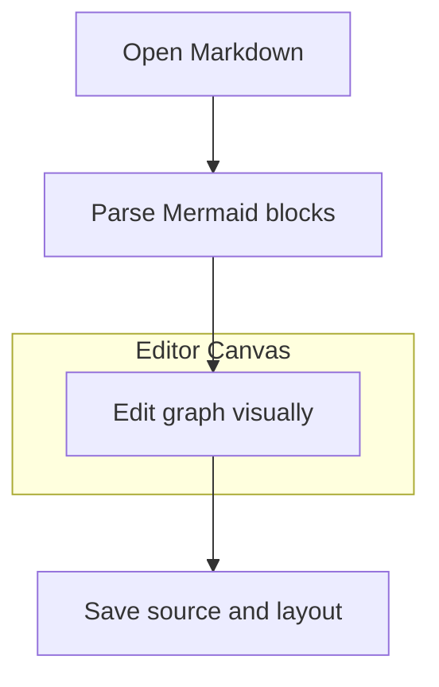
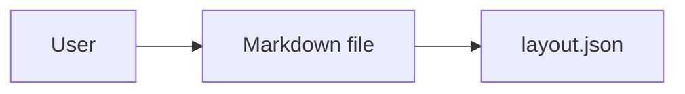

# Mermaid Editor Sample

This sample keeps the editor runnable without relying on external absolute paths.

```mermaid
flowchart TD
    start["Open Markdown"]
    parse["Parse Mermaid blocks"]
    edit["Edit graph visually"]
    save["Save source and layout"]

    subgraph Canvas["Editor Canvas"]
        direction TB
        edit
    end

    start --> parse --> edit --> save
```

```mermaid
flowchart LR
    user["User"]
    markdown["Markdown file"]
    layout["layout.json"]
    user --> markdown
    markdown --> layout
```
