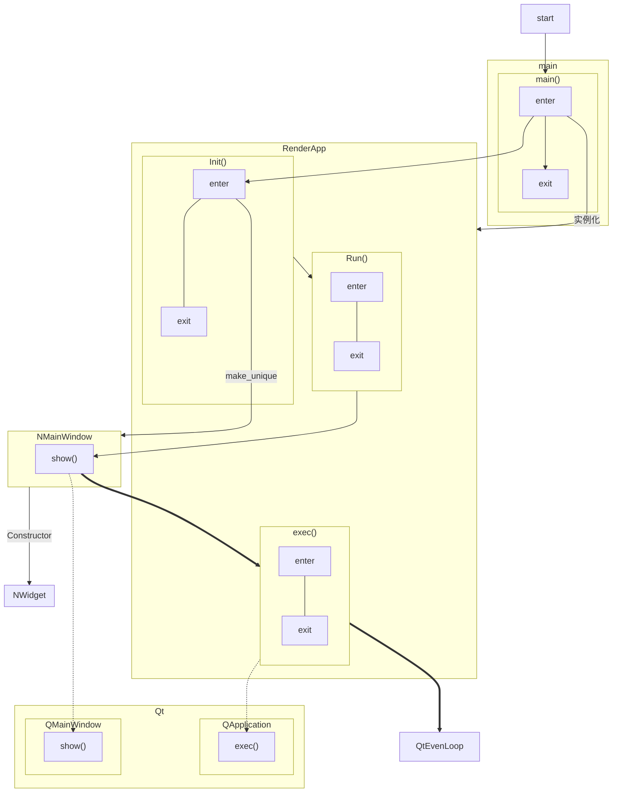
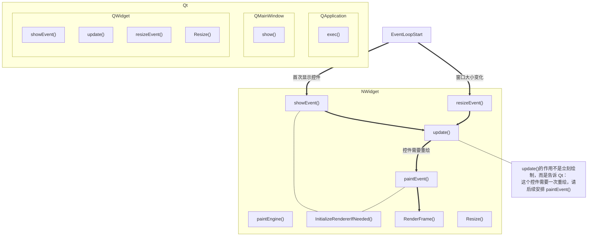

```mermaid
flowchart TD
    start
    QtEvenLoop
    subgraph Main["main"]
        direction TB
        subgraph main_func_main["main()"]
            direction TB
            main_func_main_enter["enter"]
            main_func_main_exit["exit"]
        end
    end
    subgraph RenderApp["RenderApp"]
        direction TB
        subgraph app_func_init["Init()"]
            direction TB
            app_func_init_enter["enter"]
            app_func_init_exit["exit"]
        end
        subgraph app_func_run["Run()"]
            direction TB
            app_func_run_enter["enter"]
            app_func_run_exit["exit"]
        end
        subgraph app_func_exec["exec()"]
            direction TB
            app_func_exec_enter["enter"]
            app_func_exec_exit["exit"]
        end
    end
    subgraph NMainWindow["NMainWindow"]
        direction TB
        nmainwindow_func_show["show()"]
    end
    subgraph NWidget["NWidget"]
    end
    subgraph Qt["Qt"]
        direction TB
        subgraph QApplication["QApplication"]
            direction TB
            qapp_func_exec["exec()"]
        end
        subgraph QMainWindow["QMainWindow"]
            direction TB
            qmainwindow_func_show["show()"]
        end
    end

    nmainwindow_func_show ==>  app_func_exec==> QtEvenLoop
    app_func_init_enter --- app_func_init_exit
    app_func_init_enter --make_unique--> NMainWindow
    NMainWindow --Constructor--> NWidget
    app_func_run_enter --- app_func_run_exit
    app_func_exec_enter --- app_func_exec_exit
    nmainwindow_func_show -.-> qmainwindow_func_show
    app_func_exec -.-> qapp_func_exec
    start --> main_func_main
    app_func_init --> app_func_run
    app_func_run --> nmainwindow_func_show
    main_func_main_enter --> main_func_main_exit
    main_func_main_enter --> app_func_init_enter
    main_func_main_enter --实例化--> RenderApp
```

```mermaid
flowchart TD
    EventLoopStart
    nwidget_func_update_info["
update()的作用不是立刻绘制，而是告诉 Qt：
这个控件需要一次重绘，请后续安排 paintEvent()"]
    subgraph NWidget["NWidget"]
        direction TB
        nwidget_func_showEvent["showEvent()"]
        nwidget_func_resizeEvent["resizeEvent()"]
        nwidget_func_paintEvent["paintEvent()"]
        nwidget_func_paintEngine["paintEngine()"]
        nwidget_func_InitializeRendererIfNeeded["InitializeRendererIfNeeded()"]
        nwidget_func_RenderFrame["RenderFrame()"]
        nwidget_func_update["update()"]
        nwidget_func_Resize["Resize()"]
    end
    subgraph Qt["Qt"]
        direction TB
        subgraph QApplication["QApplication"]
            direction TB
            qapp_func_exec["exec()"]
        end
        subgraph QMainWindow["QMainWindow"]
            direction TB
            qmainwindow_func_show["show()"]
        end
        subgraph QWidget["QWidget"]
            direction TB
            qwidget_func_showEvent["showEvent()"]
            qwidget_func_update["update()"]
            qwidget_func_resizeEvent["resizeEvent()"]
            qwidget_func_Resize["Resize()"]
        end
    end

    EventLoopStart ==首次显示控件==> nwidget_func_showEvent
    nwidget_func_showEvent ==> nwidget_func_update
    EventLoopStart ==窗口大小变化==> nwidget_func_resizeEvent
    nwidget_func_resizeEvent ==> nwidget_func_update
    nwidget_func_update ==控件需要重绘==> nwidget_func_paintEvent
    nwidget_func_paintEvent ==> nwidget_func_RenderFrame
    nwidget_func_showEvent --- nwidget_func_InitializeRendererIfNeeded
    nwidget_func_paintEvent --- nwidget_func_InitializeRendererIfNeeded
    nwidget_func_update --- nwidget_func_update_info
```